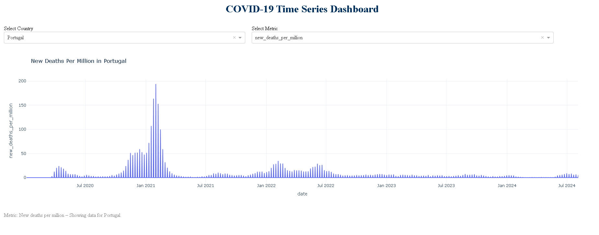

# COVID-19 Time Series Dashboard

An interactive dashboard built with Dash, Plotly, and Pandas to visualize COVID-19 trends across countries over time.

---

## Features

- View time series of COVID-19 metrics by country
- Interactive dropdowns to filter by metric and country
- Smoothed daily cases, deaths, tests, and more
- Clean and professional UI with responsive design

---

## Project Structure

- app.py (Main Dash application)
- utils.py (Helper functions for data loading and filtering)
- requirements.txt (Python dependencies)
- README.md (Project overview)

---

## How to Run

#### 1. Clone the repo:

git clone https://github.com/YOUR_USERNAME/covid_dashboard.git, cd covid_dashboard

#### 2. Install dependencies:

pip install -r requirements.txt

#### 3. Run the app:

python app.py

#### 4. Then visit: http://127.0.0.1:8050

---

## Future Improvements

- Add multi-country comparisons
- Enable trend smoothing controls
- Include per-capita metrics
- Export charts to images/PDF
  
---

## Screenshot

---

## Data Source

Data from [Our World in Data](https://ourworldindata.org/coronavirus-source-data)
